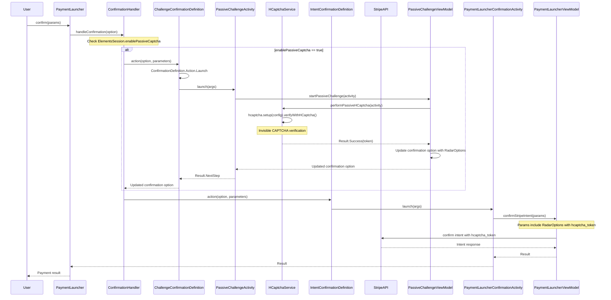

# Passive CAPTCHA Challenge Flow Sequence Diagram

This sequence diagram shows the flow of how payment confirmation works with the passive CAPTCHA challenge integration.

## Flow Description

1. The flow starts with the user initiating payment confirmation
2. When passive CAPTCHA is enabled (via `ElementsSession.enablePassiveCaptcha`), the `ChallengeConfirmationDefinition` is hit first
3. HCaptcha verification is performed invisibly in `PassiveChallengeActivity`
4. The confirmation option is updated with the CAPTCHA token in `RadarOptions`
5. The flow then continues to the regular `IntentConfirmationDefinition` with the updated params
6. The API request includes the CAPTCHA token for fraud prevention