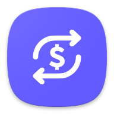

 Stripe Financial Connections Android SDK (Beta)
======

Stripe Financial Connections Android SDK lets your users securely share their financial data by
linking their external financial accounts to your business in your Android app.

# Table of contents

<!--ts-->

* [Features](#features)
* [Requirements](#requirements)
* [Getting started](#getting-started)
    * [Integration](#integration)
    * [Example](#example)

<!--te-->

## Features

**Prebuilt UI**: We
provide [`FinancialConnectionsSheet`](https://stripe.dev/stripe-android/financial-connections/com.stripe.android.financialconnections/-financial-connections-sheet/index.html)
, a prebuilt UI that combines all the steps required for your users to linking their external
financial accounts to your business.

Data retrieved through Financial Connections can help you unlock a variety of use cases, including:

- Tokenized account and routing numbers let you instantly verify bank accounts for ACH Direct Debit
  payments.
- Real-time balance data helps you avoid fees from insufficient funds failures before initiating a
  bank-based payment or wallet transfer.
- Account ownership information, such as the name and address of the bank accoun tholder, helps you
  mitigate fraud when onboarding a customer or merchant.
- Transactions data that you can use to help users track expenses, handle bills, manage their
  finances, and take control of their financial well-being.
- Transactions and balance data helps you speed up underwriting and improve access to credit and
  other financial services.

## Requirements

* Android 5.0 (API level 21) and above
* [Android Gradle Plugin](https://developer.android.com/studio/releases/gradle-plugin) 3.5.1
* [Gradle](https://gradle.org/releases/) 5.4.1+
* [AndroidX](https://developer.android.com/jetpack/androidx/) (as of v11.0.0)

## Getting started

### Integration

Get started with Stripe Financial
Connections [📚 Android integration guide](https://stripe.com/docs/financial-connections/other-data-powered-products?platform=android),
or [📘 browse the SDK reference](https://stripe.dev/stripe-android/financial-connections/com.stripe.android.financialconnections/index.html)
for fine-grained documentation of all the classes and methods in the SDK.

### Example 

#### Install

To run the Financial Connections Example app:

1. Clone the `stripe-android` repository.
2. Open the project in Android Studio.
3. Build and run the `financial-connections-example` project.

#### Remix the example project on Glitch

We provide an example backend hosted on Glitch, allowing you to easily test an integration
end-to-end.

1. [Open the Glitch project](https://glitch.com/edit/#!/stripe-mobile-connections-example).
2. Click on "Remix", on the top right.
3. In your newly created project, open the `.env` file in the left sidebar.
4. Set your [Stripe testmode public and secret keys](https://dashboard.stripe.com/test/apikeys) as
   the `STRIPE_TEST_PUBLIC_KEY` and `STRIPE_TEST_SECRET_KEY` fields.
5. Your backend implementation should now be running. You can see the logs by clicking on "Logs" in
   the bottom bar.

#### Configure the app

1. If it doesn't exist, create a `gradle.properties` in a location defined in the
   [Gradle Build Environment docs](https://docs.gradle.org/current/userguide/build_environment.html#sec:gradle_configuration_properties)
   .
   For example, the default location on macOS is `~/.gradle/gradle.properties`.
2. Append the following entries to `gradle.properties`.

```
# Set to the remixed example backend project in Glitch
STRIPE_FINANCIAL_CONNECTIONS_EXAMPLE_BACKEND_URL=https://stripe-mobile-connections-example.glitch.me/
```


